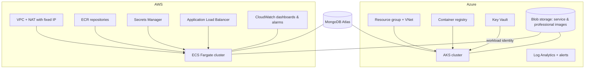

# HomeEase — infrastructure

Terraform for the cloud resources that run HomeEase on **Azure** (AKS) and **AWS** (ECS Fargate), plus the Azure DevOps pipelines that plan and apply it. The application is in `app_Homeease`; Kubernetes deployment configuration is in `gitops_homeease`.



## Repository layout

```
terraform/
  azure/
    bootstrap/        Remote-state storage account (run once)
    modules/          resource-group, networking, acr, aks, keyvault, monitoring,
                      alerts, workload-identity, ci-identity
    environments/     dev, dev-identity, staging, prod
  aws/
    bootstrap/        S3 bucket for Terraform state (run once)
    modules/          networking, ecr, secrets, ci-oidc, tf-apply-role,
                      ecs-cluster, ecs-service, alb
    environments/     dev (foundation), fargate-dev (the running app), staging, prod
    _reference-eks/   Kept for comparison: how the same app would run on EKS
  persistent/
    azure-storage/    Image storage, kept in its own stack on purpose
pipelines/            Azure DevOps: plan, setup, drift detection, destroy
azure-pipelines.yml   Main Terraform pipeline for Azure
```

Each environment composes the modules and keeps its own remote state. Staging and prod are defined and plan-only; they are not deployed.

## Azure

`environments/dev` builds the resource group, network, container registry, AKS cluster, Key Vault, Log Analytics and one workload identity per app, so pods read secrets from Key Vault without any stored credentials. `dev-identity` holds the identities the CI pipelines use.

The pipeline (`azure-pipelines.yml`):

1. **Validate** — `terraform fmt`, `validate`, TFLint, Checkov, Gitleaks and an Infracost monthly cost estimate.
2. **Plan** each environment and publish the plan. A pull request only plans.
3. **Apply dev** on `main`, behind a manual approval on the `homeease-dev` environment.

Other pipelines in `pipelines/`: a nightly **drift check** at 02:00 IST that fails when someone changes Azure by hand, and a manual **destroy** for dev that requires typing a confirmation word. Pipeline runs are serialised so two applies never fight over the state lock.

## AWS

AWS is split into two stacks that share data through `terraform_remote_state`:

- **`environments/dev`** — the foundation that survives nightly shutdowns: VPC, a NAT gateway with a fixed Elastic IP (MongoDB Atlas allows only that address), ECR repositories, empty Secrets Manager entries, and the GitHub OIDC role used by CI.
- **`environments/fargate-dev`** — the running application: ECS cluster with Service Connect, six Fargate services, the ALB, IAM, security groups, autoscaling, four CloudWatch dashboards, alarms, an SNS topic and a monthly budget.

Design choices:

- **Fargate over EC2 or EKS** — nothing to patch or scale, billing per task, and it suits six small services.
- **Service Connect** gives services short DNS names (`backend`, `payment-service`), mirroring Kubernetes service names.
- **Deployment circuit breaker** rolls back a release that never becomes healthy, and each container has its own health check.
- **Least-privilege security groups** — each service accepts traffic only from its real callers.
- **Fargate Spot** carries most capacity at lower cost, with autoscaling on CPU.
- **Secrets are never in Terraform.** Terraform creates empty containers; values are set by hand in Secrets Manager, so they stay out of the state file.

CI writes the new image tag into `terraform/aws/environments/fargate-dev/image-tags.auto.tfvars` after each successful build, so a release is `terraform apply` followed by a restart. AWS Terraform is applied by hand on purpose.

### Day-to-day (AWS)

```bash
cd terraform/aws/environments/fargate-dev
terraform apply                                   # deploys the tags CI committed
```

Stop the costly parts at night by destroying `fargate-dev` and the NAT gateway (the ALB, tasks and NAT are what bill by the hour); the VPC, ECR, secrets and the Elastic IP stay, so the Atlas allowlist remains valid. Bring it back with `terraform apply`, then restart the services that call the backend once it is up. Details and the AWS-specific setup are in `terraform/aws/environments/fargate-dev/README.md`.

## Conventions

- Terraform is pinned (`required_version`, provider versions, committed `.terraform.lock.hcl`).
- Everything is tagged `project`, `environment`, `owner`, `managed_by`.
- State is remote and locked: Azure Storage on Azure, S3 on AWS. Never commit state or `.tfvars` files that hold real values; commit `terraform.tfvars.example` instead.
- Quality tooling: `.tflint.hcl`, `.checkov.yaml` and `.terraform-docs.yml` configure the linters and generated docs.

## Known limits

- One task per service and a single NAT gateway: a dev setup, not highly available.
- The AWS load balancer serves plain HTTP; HTTPS needs a domain and a certificate (the ALB module already supports one).
- The load balancer address changes if the ALB is destroyed and recreated.
