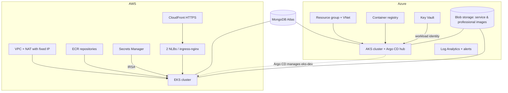

# HomeEase — infrastructure

Terraform for the cloud resources that run HomeEase on **Azure** (AKS) and **AWS** (EKS), plus the pipelines that plan and apply it. The application is in [`app_Homeease`](https://github.com/SrinidhiSanjeevi/app_Homeease); Kubernetes deployment configuration is in [`Gitops_Homeease`](https://github.com/SrinidhiSanjeevi/Gitops_Homeease).

Both clouds use the same delivery model: Terraform builds the cluster, and **one Argo CD, running on AKS**, deploys the same Helm charts to AKS and to EKS (registered as cluster `eks-dev`).



## Layout

```
terraform/
  azure/
    bootstrap/               remote-state storage account
    environments/dev         RG, VNet, ACR, AKS, Key Vault, Log Analytics, alerts, budget, workload identities
    environments/dev-identity  identities the CI pipelines use
    environments/staging, prod   same shape as dev, planned on every run, not deployed
    modules/                 acr, aks, alerts, ci-identity, keyvault, monitoring, networking, resource-group, workload-identity
  aws/
    bootstrap/               S3 state bucket
    environments/dev         foundation: VPC, NAT + Elastic IP, ECR, Secrets Manager containers, GitHub OIDC role
    environments/eks-dev     EKS cluster, node group, add-ons, IRSA roles, CloudFront, budget
    environments/fargate-dev legacy ECS Fargate stack (superseded by eks-dev, kept for comparison)
    environments/staging, prod   apply-role and budget skeletons
    modules/                 eks, irsa, networking, ecr, secrets, ci-oidc, cloudfront, tf-apply-role, alb, ecs-cluster, ecs-service
  persistent/azure-storage   image storage that survives environment teardowns
pipelines/                   Azure DevOps templates used by azure-pipelines.yml
.github/workflows/           AWS: aws-eks-apply.yml, aws-fargate-destroy.yml
docs/adr/                    architecture decisions (0001 superseded by 0002)
docs/production-readiness-review.md
```

## Azure

`environments/dev` builds the resource group, network, container registry, AKS cluster, Key Vault, Log Analytics, alerts, a budget and one workload identity per app, so pods read secrets from Key Vault without any stored credentials. `dev-identity` holds the identities the CI pipelines use.

The pipeline (`azure-pipelines.yml`, triggered by changes under `terraform/azure/`):

1. **Validate** — Gitleaks, `terraform fmt`, `terraform validate` for every environment, TFLint, Infracost monthly cost estimate and Checkov.
2. **Plan** dev, staging and prod, and publish the plans. A pull request only plans.
3. **Apply dev** on `main` from the saved plan, behind a manual approval on the `homeease-dev` environment. Staging and prod have approval-gated demo applies that deploy nothing.

## AWS

AWS is split into stacks that share data through `terraform_remote_state`:

- **`environments/dev`** — the foundation that survives cluster teardowns: VPC, a NAT gateway with a fixed Elastic IP (MongoDB Atlas allows only that address), ECR repositories, empty Secrets Manager entries, and the GitHub OIDC role used by CI.
- **`environments/eks-dev`** — the running platform: EKS with a managed node group, add-ons (VPC CNI with NetworkPolicy, CoreDNS, kube-proxy, EBS CSI, metrics-server), three IRSA roles (app, payment, notification), EKS access entries, two CloudFront distributions for HTTPS, the CI apply role and a monthly budget. See its [README](terraform/aws/environments/eks-dev/README.md).
- **`environments/fargate-dev`** — the earlier ECS Fargate stack (ALB, Service Connect, CloudWatch dashboards and alarms). Kept as code; [ADR-0002](docs/adr/0002-eks-with-gitops-on-aws.md) explains the move to EKS.

Design choices:

- **EKS, managed by the Argo CD on AKS** — the same charts, the same GitOps flow and the same Prometheus/Grafana stack on both clouds; a deployment on AWS is a commit to `values-aws-dev.yaml`.
- **IRSA** gives each service group its own IAM role, readable only for its own Secrets Manager entries.
- **Secrets are never in Terraform.** Terraform creates empty containers; values are set by hand, so they stay out of the state file (`modules/secrets/SECRETS.md`, `azure/modules/keyvault/SECRETS.md`).
- **No long-lived cloud keys in CI** — GitHub Actions assumes AWS roles through OIDC; Azure DevOps uses workload identity federation.

Pipelines (GitHub Actions, run by hand with `workflow_dispatch`):

- **`aws-eks-apply`** — plan or apply `eks-dev`, then bootstrap the cluster add-ons (`gitops_homeease/scripts/bootstrap-eks.sh`), then enable CloudFront once the load balancers exist. Registering the cluster in the AKS Argo CD is a one-time step described in the eks-dev README.
- **`aws-fargate-destroy`** — tears down the legacy `fargate-dev` stack after checking that EKS is up; requires typing a confirmation word.

## Local checks

```bash
terraform -chdir=terraform fmt -check -recursive
cd terraform/aws/environments/eks-dev && terraform init -backend=false && terraform validate
```

Every root (`bootstrap`, each `environments/*`, `persistent/azure-storage`) validates the same way. Copy `terraform.tfvars.example` to `terraform.tfvars` before a real plan; `.tfvars`, state and plan files are gitignored.
