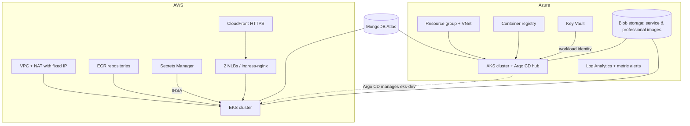

# HomeEase — infrastructure

Terraform for every cloud resource HomeEase runs on, plus the pipelines that plan and apply it:

- **Azure** — AKS, ACR, Key Vault, monitoring and governance.
- **AWS** — EKS (current), and the earlier ECS Fargate stack kept for comparison.

Everything is infrastructure as code. Nothing in the cloud is created by hand, except secret values, which stay out of Terraform on purpose.

## Live links

| Environment | Built by | Customer site | Admin console |
|---|---|---|---|
| Azure — AKS | `terraform/azure/environments/dev` | https://homeease-app.centralindia.cloudapp.azure.com | https://homeease-admin.centralindia.cloudapp.azure.com |
| AWS — EKS | `terraform/aws/environments/eks-dev` | https://d1c07dtmd5gx45.cloudfront.net | https://d3220hgmchhivu.cloudfront.net |
| AWS — ECS Fargate (legacy) | `terraform/aws/environments/fargate-dev` | https://d1dtc9ngh4fly7.cloudfront.net | https://d3vprnd9vqtd6q.cloudfront.net |

| Tool | Link |
|---|---|
| Azure DevOps (Terraform pipeline) | https://dev.azure.com/homeease/HomeEase/_build |
| GitHub Actions (EKS apply, Fargate destroy) | https://github.com/SrinidhiSanjeevi/Infrastruture_Homeease/actions |
| CloudWatch dashboards (Fargate) | [business](https://ap-south-1.console.aws.amazon.com/cloudwatch/home?region=ap-south-1#dashboards/dashboard/homeease-dev-business-overview) · [payments](https://ap-south-1.console.aws.amazon.com/cloudwatch/home?region=ap-south-1#dashboards/dashboard/homeease-dev-payment-service) · [RED / ECS](https://ap-south-1.console.aws.amazon.com/cloudwatch/home?region=ap-south-1#dashboards/dashboard/homeease-dev-red-ecs) · [logs](https://ap-south-1.console.aws.amazon.com/cloudwatch/home?region=ap-south-1#dashboards/dashboard/homeease-dev-logs) |

Cluster access: `az aks get-credentials -g rg-homeease-dev -n aks-homeease-dev` (AKS) and `aws eks update-kubeconfig --name homeease-eks-dev --region ap-south-1` (EKS).

## Related repositories

- [app_Homeease](https://github.com/SrinidhiSanjeevi/app_Homeease) — the six services; its CI pushes images to the ACR and ECR created here.
- [Gitops_Homeease](https://github.com/SrinidhiSanjeevi/Gitops_Homeease) — Helm charts and Argo CD apps that run on the clusters created here.

## Architecture



## Concepts implemented

**Modules and environments.**
- Reusable modules (`modules/`) are composed by thin environment folders (`environments/<env>`).
- dev, staging and prod use the same modules with different variables, so they differ only in size and names.

**Remote state with locking.**
- Azure state is in a storage account (`azurerm` backend, Entra ID auth, no access keys).
- AWS state is in S3 with encryption and S3-native locking.
- The state stores are created by the separate `bootstrap/` stacks.

**Layered stacks on AWS.**
- The long-lived foundation (`environments/dev`: VPC, NAT, ECR, secret containers, OIDC role) is separate from the compute stacks (`eks-dev`, `fargate-dev`).
- The compute stacks read the foundation through `terraform_remote_state`.
- A cluster can be destroyed and rebuilt without touching the registry, the network or the fixed IP that MongoDB Atlas allows.

**Identity instead of keys.**
- On AKS, each app group has its own managed identity, federated to its Kubernetes service account (workload identity), with read-only access to Key Vault.
- On EKS, each group has its own IAM role through IRSA, readable only for its own Secrets Manager entries.
- CI uses OIDC on both clouds: Azure DevOps workload identity federation, and the GitHub OIDC role on AWS. No long-lived cloud keys are stored anywhere.

**Secrets never in Terraform.**
- Terraform creates the empty Key Vault / Secrets Manager containers and the access rules.
- Values are set by hand, so they never land in the state file. See `modules/secrets/SECRETS.md` and `azure/modules/keyvault/SECRETS.md`.

**AKS cluster** (`azure/modules/aks`):
- Azure CNI overlay with Azure network policy, so the NetworkPolicies in the GitOps charts are enforced.
- Node autoscaling from 1 to 3 nodes.
- OIDC issuer and workload identity, the Key Vault CSI secrets provider, and Azure Policy enabled.

**EKS cluster** (`aws/modules/eks`):
- A managed node group in private subnets.
- Add-ons: VPC CNI with NetworkPolicy enforcement, CoreDNS, kube-proxy, EBS CSI driver and metrics-server.
- EKS access entries declare who may use `kubectl`.
- Nodes reach the internet only through the NAT gateway, so the Atlas allow-list holds one IP.

**HTTPS on AWS without a domain.** Two CloudFront distributions (customer and admin) terminate HTTPS in front of the two ingress NLBs.

**Governance and cost.**
- A policy assignment requires tags on Azure resources.
- Monthly budgets with email alerts exist on both clouds.
- Infracost prints the monthly cost of every Terraform change in the pipeline.

**Monitoring and audit.**
- Azure: Log Analytics and node CPU/memory metric alerts.
- The Fargate stack adds CloudTrail, GuardDuty (findings routed to SNS email), four CloudWatch dashboards and alarms.

**Decisions are recorded.** [ADR-0001](docs/adr/0001-ecs-fargate-over-eks.md) chose ECS Fargate first. [ADR-0002](docs/adr/0002-eks-with-gitops-on-aws.md) supersedes it with EKS, so both clouds share one GitOps delivery model. [docs/production-readiness-review.md](docs/production-readiness-review.md) reviews the platform against an SRE checklist.

## Pipelines

**Azure DevOps — `azure-pipelines.yml`** (runs on changes under `terraform/azure/`):
1. **Validate:** Gitleaks, `terraform fmt`, `terraform validate` for every environment, TFLint, Checkov (security misconfigurations) and Infracost (monthly cost).
2. **Plan** dev, staging and prod, and publish the plans. A pull request stops here.
3. **Apply dev** on `main` from the saved plan, after a manual approval on the `homeease-dev` environment. Staging and prod have approval-gated demo applies that deploy nothing.

**GitHub Actions** (run by hand; choosing *apply* is the approval):
- **`aws-eks-apply`:**
  1. Plan or apply `eks-dev`.
  2. Bootstrap the cluster add-ons with `Gitops_Homeease/scripts/bootstrap-eks.sh`.
  3. Turn on CloudFront once the load balancers exist.

  Registering the new cluster in the AKS Argo CD is a one-time step; see the [eks-dev README](terraform/aws/environments/eks-dev/README.md).
- **`aws-fargate-destroy`:** tears down the legacy Fargate stack. It runs only after you type a confirmation phrase and only when EKS is up and serving. It keeps the audit trail (CloudTrail, GuardDuty, audit bucket).

## Running Terraform locally

```bash
cd terraform/aws/environments/eks-dev && cp terraform.tfvars.example terraform.tfvars
terraform init && terraform plan -out tfplan && terraform apply tfplan
```
